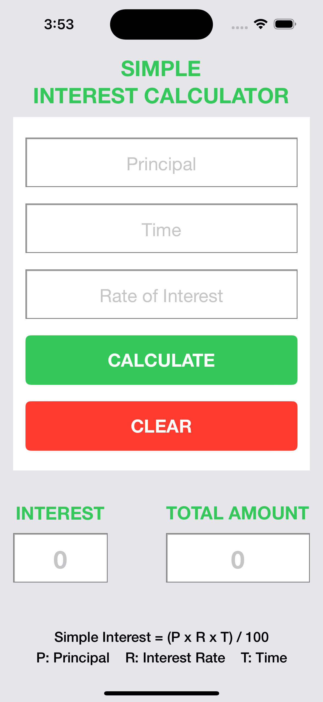
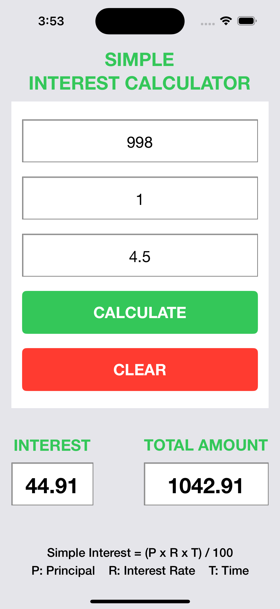

# iOS-Swift-Interest-Calculator
Basic iOS Swift Interest Calculator

### HOW TO RUN:
```console
run project in Xcode
```

### DESCRIPTIONS:
Features:
1. Gets principal, time and interest rate values from the user via a **form**.
2. Calculates the interest and total amount values. Then displays the results on the screen with **Calculate Button**.
3. Clears all input fields with **Clear Button**.

### SCREENSHOTS:
<kbd></kbd>    <kbd></kbd>
